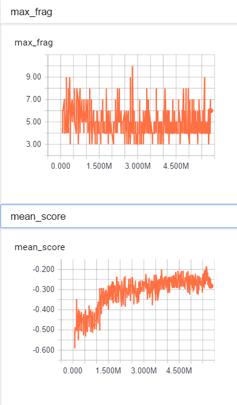
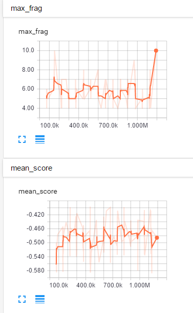
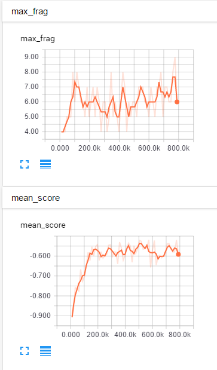

#doom normal
## resolution
* 120x160

## network
* pong network(naive)

## reward
* dead:-10, shot_miss:-2, health_decrease(<40):-1, kill:+5, turn_left:+0.1

## result

#doom current frame + attention
## resolution
* 120x120

## network
* cig network

## reward
* dead:-10, shot_miss:-2, health_decrease(less than 40):-1, kill:+5, turn_left:+0.1

## result

#doom hist_len=4, attention
## resolution
* 120x120

## network
* cig network

## reward
* dead:-10, shot_miss:-2, health_decrease(less than 40):-1, kill:+5, turn_left:+0.1

## result

